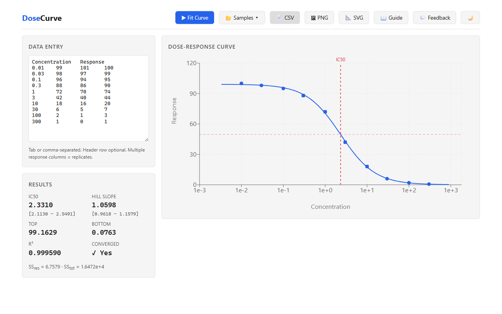

# DoseCurve

**Free, open-source dose-response curve fitting and IC50 calculator — replaces the GraphPad Prism workflow.**



## What It Does

DoseCurve fits a **4-Parameter Logistic (4PL)** model to your concentration-response data and reports the **IC50** with 95% confidence intervals — the same analysis pharmacologists pay $142–$1,040/yr to run in GraphPad Prism. Paste your data, click Fit, get publication-quality results in seconds.

## Features

- **Paste-and-go data entry** — paste concentration-response pairs or upload CSV, with replicate support
- **4PL curve fitting** — Levenberg-Marquardt nonlinear least-squares regression
- **IC50 + confidence intervals** — IC50, Hill slope, top/bottom plateaus with 95% CI via Jacobian-based covariance
- **Publication-quality chart** — log₁₀ concentration x-axis, data points with SEM error bars, fitted curve overlay, IC50 annotation
- **Goodness-of-fit metrics** — R², sum of squared residuals, residual plot
- **Export** — download chart as PNG/SVG, results as CSV
- **Light & dark theme**

## Quick Start

```bash
# Prerequisites: Node.js ≥ 18, pnpm
git clone https://github.com/your-org/dosecurve.git
cd dosecurve
pnpm install
pnpm build        # build engine + web
pnpm dev           # start dev server
pnpm test          # run all tests
```

Open [http://localhost:5173](http://localhost:5173), paste your concentration-response data, and hit **Fit Curve**.

## Key Equations

### 4-Parameter Logistic Model

```
y = Bottom + (Top − Bottom) / (1 + (x / IC50)^n)
```

| Parameter | Meaning |
|-----------|---------|
| **Top** | Upper asymptote (max response) |
| **Bottom** | Lower asymptote (min response) |
| **IC50** | Concentration producing 50% response |
| **n** (Hill slope) | Steepness of the curve |

### Levenberg-Marquardt Optimization

Iteratively solves for parameter updates:

```
Δp = (JᵀJ + λI)⁻¹ Jᵀr
```

where **J** is the Jacobian matrix, **r** is the residual vector, and **λ** is the damping factor that interpolates between gradient descent and Gauss-Newton.

### Coefficient of Determination

```
R² = 1 − SS_res / SS_tot
```

## Tech Stack

| Layer | Technology |
|-------|------------|
| Curve fitting engine | TypeScript (pure math, zero dependencies) |
| Web UI | React 18 + Vite |
| Charting | Recharts |
| Monorepo | pnpm workspaces |
| Testing | Vitest |

## Project Structure

```
dosecurve/
├── packages/
│   ├── engine/             # 4PL fitting library
│   │   └── src/
│   │       ├── parser.ts       # data parsing & replicate summarization
│   │       ├── fit.ts          # 4PL model + Levenberg-Marquardt solver
│   │       ├── confidence.ts   # 95% CI via Jacobian covariance
│   │       ├── goodness.ts     # R², residuals
│   │       ├── export.ts       # CSV + curve-point generation
│   │       └── __tests__/
│   └── web/                # React front-end
│       └── src/
│           ├── components/
│           │   ├── DataEntry.tsx
│           │   ├── DoseResponseChart.tsx
│           │   ├── ResultsPanel.tsx
│           │   └── Toolbar.tsx
│           └── App.tsx
├── PLAN.md
├── package.json
└── pnpm-workspace.yaml
```

## License

MIT
